# Fractional Step Method

## Navier-Stokes Equations

The Navier-Stokes equations are a set of partial differential equations (PDEs) that describe the motion of a fluid. When one considers an incompressible and constant viscosity fluid, these read

  

the first equation being the conservation of mass, and the second equation being the conservation of momentum. Here, density  and dynamic viscosity  are constants; velocity and pressure are functions of position and time, that is,

  

Let  be an open set with smooth boundary  (or at least ). Given some initial conditions on velocity and pressure

  

along with some boundary conditions, one wants to show that there exists a unique solution (in some sense) to the following problem:

  .

A problem of this kind 
In general, this problem is quite hard. However, for engineering purporses, it suffices to obtain an approximate solution via a numerical method.

## Fractional Step Method

The Fractional Step Method is a computational procedure to solve the incompressible Navier-Stokes equations. Its simplicity and the fact that in general it runs fast, makes it preferrable over other similar methods. 

## Application: Driven Cavity

As an application of the Fractional Step Method, I solved the Lid-Driven Cavity problem, which is shown below:

  .

It consists of a rectangular cavity filled with fluid and open at the top. On the left, right and lower walls, the no-slip condition is imposed. On the upper wall there is a fluid flow that drives the fluid whithin the cavity. The behavior of the fluid is modeled via the Navier-Stokes equations. 

For simplicity, ; the physical data is the following: 

  

thus the Reynolds number is . As for numerical data:

<ul>
  <li>The domain is discretized in a  node-centered mesh</li>
  <li>Pressures are computed at nodal locations</li>
  <li>Velocities are computed at control volume faces using staggered mesh (to avoid a checker board problem)</li>
  <li>QUICK scheme is used to compute velocities. It works particularly well in low Reynolds number situations</li>
  <li>Gauss-Seidel method is used to solve the linear system</li>
</ul> 

Results are shown below for times $

The simulation runs until 

The plots below show the results: left column - velocity field, right column - pressure

  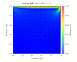
  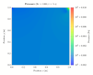

  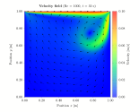
  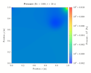

  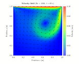
  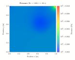

  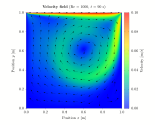
  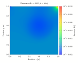

  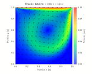
  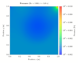

  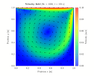
  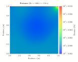

  
  

  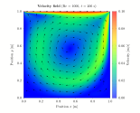
  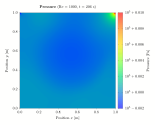

